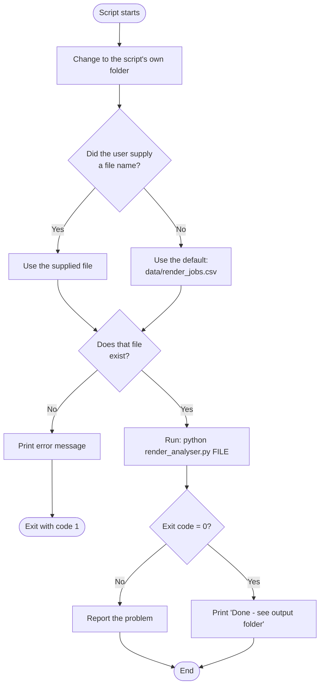
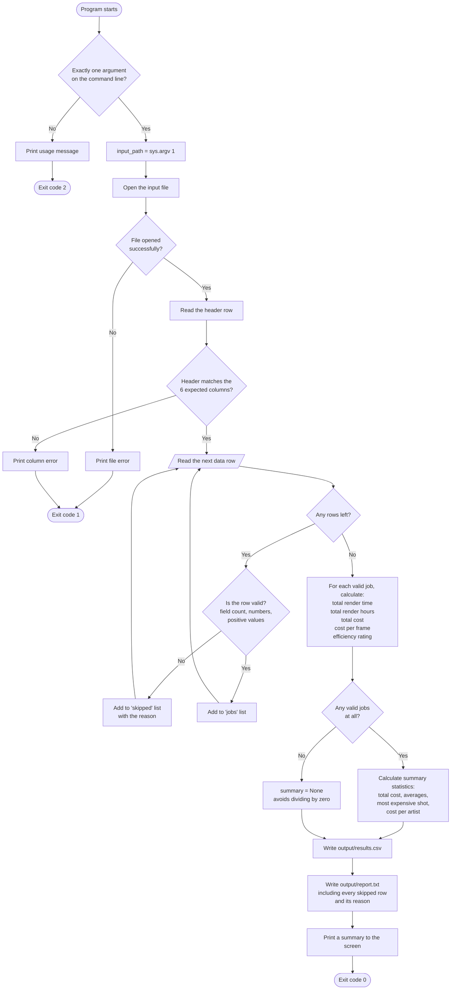
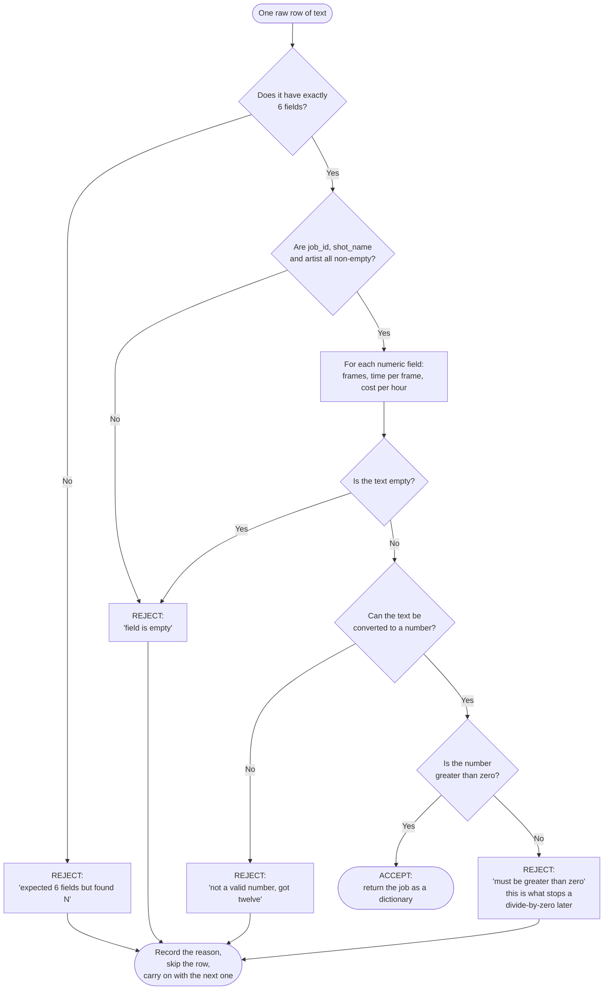

# Solution Design - Flowcharts

These diagrams document the logical operations of the program and its launcher
script, as required by the Solution Design section of the brief.

To produce an image for the Development Document, paste the code block below
into <https://mermaid.live> and export it as a PNG.

---

## Figure 1 - The launcher script (run.bat / run.sh)

The script's only job is to work out *which* data file to analyse, check it is
really there, and then hand it to the Python program as a command line argument.



Exported PNG: `figure1_launcher.png`

---

## Figure 2 - The Python program (render_analyser.py)



Exported PNG: `figure2_program.png`

---

## Figure 3 - Row validation, in detail

This is the decision logic inside `parse_row()` and `to_positive_number()`. It is
the part of the program that decides whether a row is trustworthy, and it is
where every one of the deliberate errors in `data/bad_data.csv` gets caught.



Exported PNG: `figure3_validation.png`

---

## Pseudocode (ILO 2)

```
BEGIN
    IF number of command line arguments is not 1 THEN
        print usage message
        exit with code 2
    END IF

    input_file = the command line argument

    TRY
        open input_file
    CATCH file cannot be opened
        print error
        exit with code 1
    END TRY

    read the header row
    IF header does not match the expected columns THEN
        print error
        exit with code 1
    END IF

    jobs    = empty list
    skipped = empty list

    FOR EACH row IN the file
        IF the row is valid THEN
            add it to jobs
        ELSE
            add (line number, reason) to skipped
        END IF
    END FOR

    results = empty list
    FOR EACH job IN jobs
        total_mins  = frames * render_time_per_frame
        total_hours = total_mins / 60
        total_cost  = total_hours * cost_per_hour
        cost_per_frame = total_cost / frames
        rating = Fast, Normal or Slow, depending on time per frame
        add all of these to results
    END FOR

    IF results is empty THEN
        summary = nothing        // avoids dividing by zero
    ELSE
        summary = totals, averages, most expensive shot, cost per artist
    END IF

    write results to output/results.csv
    write summary and skipped rows to output/report.txt
    print a short confirmation to the screen
    exit with code 0
END
```
